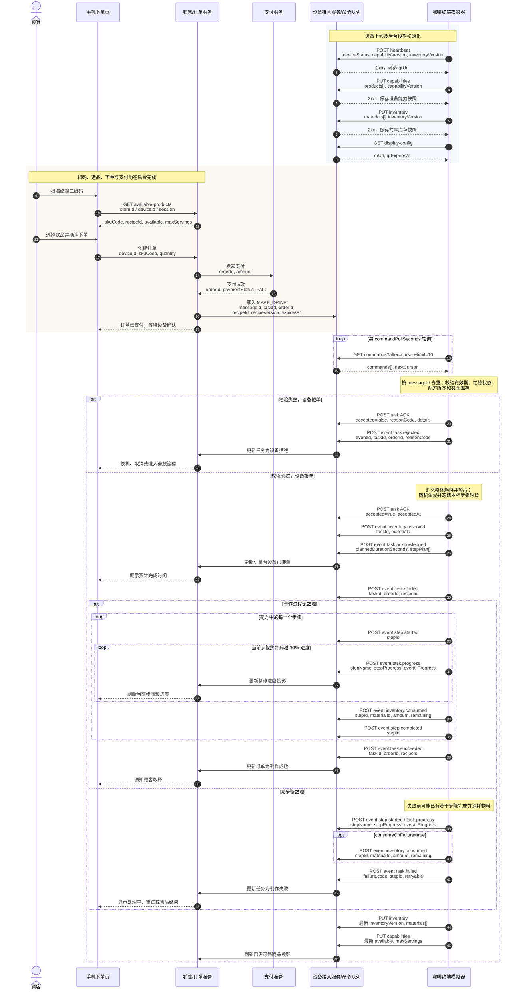

# 咖啡终端模拟器 API

接口分为两组：设备主动访问的云端 API，以及本机测试程序访问的设备本地 API。手机端不直接连接终端，应通过后台的销售服务下单。

## 1. 约定

### 1.1 请求头

远程模式下，设备发出的所有请求默认携带：

```http
Accept: application/json
Content-Type: application/json
X-Device-Id: coffee-bot-001
```

若 `device.json` 配置了 `backend.authToken`，还会携带：

```http
Authorization: Bearer <token>
```

`backend.headers` 中的字段也会合并到请求头，适合联调环境添加租户或网关标识。

### 1.2 时间、数值和版本

- 时间使用带时区的 ISO 8601 字符串，例如 `2026-08-23T12:00:00Z`。
- 物料数量使用 JSON number，单位由物料的 `unit` 给出。
- `capabilityVersion` 是有效配方内容的摘要。
- `inventoryVersion` 是库存每次变化后递增的整数。

### 1.3 设备事件信封

```json
{
  "schema": "coffee.device-event.v1",
  "eventId": "evt-uuid",
  "deviceId": "coffee-bot-001",
  "bootId": "boot-uuid",
  "sequence": 42,
  "occurredAt": "2026-08-23T12:00:00Z",
  "type": "task.progress",
  "message": "萃取咖啡",
  "payload": {}
}
```

后台应按 `eventId` 幂等处理，并可使用 `(deviceId, bootId, sequence)` 检测单次启动期间的重复或乱序。设备进程重启后 `bootId` 会变化，`sequence` 从头计数。

## 2. 云端接口总览

| 方法 | 路径 | 用途 |
| --- | --- | --- |
| `POST` | `/api/v1/device-activations` | 使用一次性激活码登记终端生成的凭证 |
| `POST` | `/api/v1/devices/{deviceId}/credentials/rotate` | 幂等轮换设备凭证 |
| `GET` | `/api/v1/devices/{deviceId}/commands` | 领取设备命令 |
| `POST` | `/api/v1/tasks/{taskId}/ack` | 接受或拒绝制作任务 |
| `POST` | `/api/v1/devices/{deviceId}/commands/{messageId}/result` | 上报非制作命令的统一执行结果 |
| `POST` | `/api/v1/devices/{deviceId}/heartbeat` | 上报设备心跳 |
| `PUT` | `/api/v1/devices/{deviceId}/capabilities` | 同步饮品能力快照 |
| `PUT` | `/api/v1/devices/{deviceId}/inventory` | 同步共享库存快照 |
| `POST` | `/api/v1/devices/{deviceId}/events` | 上报设备事件 |
| `GET` | `/api/v1/devices/{deviceId}/display-config` | 获取二维码等展示配置 |
| `POST` | `/api/v1/devices/{deviceId}/debug/orders` | 测试环境创建调试订单 |
| `POST` | `/api/v1/devices/{deviceId}/debug/commands` | 测试环境创建调试命令 |
| `PATCH` | `/api/v1/devices/{deviceId}/debug/overrides` | 更新调试覆盖参数 |
| `POST` | `/api/v1/admin/devices/{deviceId}/activation-codes` | 管理员创建一次性激活码 |
| `GET` | `/api/v1/admin/devices/{deviceId}/credentials` | 管理员查询凭证版本与状态 |
| `POST` | `/api/v1/admin/devices/{deviceId}/commands` | 管理员幂等创建正式设备命令 |
| `GET` | `/api/v1/admin/devices/{deviceId}/commands/{messageId}` | 查询命令状态和迁移历史 |

后台成功响应应返回 `2xx` 和合法 JSON 对象；无响应体时也可以返回空响应体。连接失败、超时、非成功 HTTP 状态或非法 JSON 都会被设备视为调用失败。

### 2.1 激活和凭证轮换

管理员创建激活码时使用独立的管理员 Bearer Token。响应中的 `activationCode` 只展示一次、默认 10 分钟有效；同一设备创建新码会取消旧的待用码。

终端先在本地生成至少 32 字符的高熵 Token，再激活：

```json
{
  "deviceId": "coffee-bot-002",
  "activationCode": "one-time-code",
  "deviceToken": "terminal-generated-secret"
}
```

云端只保存 Token 的 SHA-256。相同激活码和相同 Token 可以重试并得到 `duplicate: true`；同一激活码改用其他 Token 返回 `409`。

轮换请求必须由当前有效凭证认证，并携带稳定的 `Idempotency-Key`：

```http
POST /api/v1/devices/coffee-bot-002/credentials/rotate
Authorization: Bearer <current-token>
X-Device-Id: coffee-bot-002
Idempotency-Key: rotate-uuid
```

```json
{"newToken": "terminal-generated-new-secret"}
```

同一个幂等键和载荷可安全重试；同键不同载荷返回 `409`。新凭证立即生效，旧凭证进入短暂 `GRACE`，宽限结束后变为 `EXPIRED`。终端脚本使用 pending 文件保证“云端已轮换但本地响应丢失”时仍能重试同一把凭证。

### 2.2 正式命令状态

管理端创建命令也必须携带 `Idempotency-Key`。命令状态由云端统一约束：

```text
CREATED -> DELIVERING -> ACKED -> EXECUTING -> SUCCEEDED
                                          \-> FAILED / CANCELLED
DELIVERING -> REJECTED / EXPIRED
```

轮询只表示 `DELIVERING`，不能当作已接单；ACK 才进入 `ACKED`。实际终端用 `payload.taskId` 关联 `task.started`、`task.succeeded`、`task.failed` 和 `task.cancelled`。重复事件和迟到 ACK 不允许让终态倒退。服务启动时会重放已入库的关键事件，补偿“事件已保存但投影尚未推进”的崩溃窗口。

## 3. 领取设备命令

```http
GET /api/v1/devices/{deviceId}/commands?after={cursor}&limit=10
```

响应：

```json
{
  "commands": [
    {
      "messageId": "cmd-001",
      "type": "MAKE_DRINK",
      "taskId": "task-001",
      "orderId": "order-1024",
      "recipeId": "iced-latte-v1",
      "recipeVersion": "1.0.0",
      "expiresAt": "2026-08-23T12:05:00Z"
    }
  ],
  "nextCursor": "cursor-42"
}
```

`commands` 可为空。设备先把每条命令写入本地 SQLite Inbox，再保存 `nextCursor`，下次作为 `after` 传回。`messageId` 应全局唯一；设备跨进程去重，同 ID 不同载荷会被拒绝。`MAKE_DRINK` 还按 `taskId` 做业务去重，即使命令服务换了 messageId，也不会再次制作同一任务。

支持的命令类型：

| `type` | 必要字段 | 行为 |
| --- | --- | --- |
| `MAKE_DRINK` | `messageId`、`taskId`、`recipeId` | 校验并执行饮品任务 |
| `DEBUG_COMMAND` | `messageId`、`action` | 执行调试动作 |
| `RELOAD_CONFIG` | `messageId` | 重载本地配置 |
| `INVENTORY_ADJUSTMENT` | `messageId`、`payload` | 调整本地物料 |
| `CANCEL_TASK` | `messageId`、`taskId` | 仅取消 ID 匹配的当前活动任务 |

`DEBUG_COMMAND.action` 支持 `pause`、`resume`、`skip`、`retry`、`cancel`、`clear`、`force-fail` 和 `toggle-offline`，但动作是否成功取决于当前任务状态。

`INVENTORY_ADJUSTMENT.payload` 与本地库存调整接口的请求体相同。

## 4. 制作任务校验与 ACK

设备收到 `MAKE_DRINK` 后才会校验配方、版本、命令有效期、设备占用状态和共享库存。命令出现在轮询响应中不代表已经接单。

```http
POST /api/v1/tasks/{taskId}/ack
```

接受：

```json
{
  "messageId": "cmd-001",
  "deviceId": "coffee-bot-001",
  "accepted": true,
  "acceptedAt": "2026-08-23T12:00:01Z"
}
```

拒绝：

```json
{
  "messageId": "cmd-001",
  "deviceId": "coffee-bot-001",
  "accepted": false,
  "acceptedAt": "2026-08-23T12:00:01Z",
  "reasonCode": "MATERIAL_INSUFFICIENT",
  "details": {
    "materialId": "milk",
    "required": 180,
    "available": 120,
    "unit": "ml"
  }
}
```

拒绝码：

| `reasonCode` | 含义 | 常见 `details` |
| --- | --- | --- |
| `INVALID_COMMAND` | 缺少字段或时间格式无效 | `required` 或 `field` |
| `COMMAND_EXPIRED` | 命令已过期 | `expiresAt` |
| `DEVICE_BUSY` | 当前已有活动任务 | `currentTaskId` |
| `RECIPE_NOT_FOUND` | 本机没有该配方 | `recipeId` |
| `RECIPE_DISABLED` | 配方存在但已禁用 | `recipeId` |
| `RECIPE_VERSION_MISMATCH` | 后台指定版本与本机不一致 | `requested`、`installed` |
| `MATERIAL_INSUFFICIENT` | 整杯所需共享库存不足 | 物料、需求量和可用量 |
| `TASK_ID_CONFLICT` | 已存在的 taskId 对应另一订单或配方 | 原值和请求值 |

HTTP ACK 只表达接单结果。本杯随机抽取并冻结的步骤时长通过随后发送的 `task.acknowledged` 事件上报。

ACK 在接单结果和任务落入本地持久状态后加入发送队列。网络错误、429 和 5xx 会跨重启重试；后台返回 409 时按幂等重复视为已确认；永久 4xx 进入本地死信并显示在健康状态中。后台仍必须以 `messageId/taskId` 幂等，并结合设备事件做超时与人工处置。

### 4.1 非制作命令结果

`DEBUG_COMMAND`、`RELOAD_CONFIG`、`INVENTORY_ADJUSTMENT`、`CANCEL_TASK` 和未知类型命令统一调用：

```http
POST /api/v1/devices/{deviceId}/commands/{messageId}/result
```

```json
{
  "messageId": "cmd-control-001",
  "deviceId": "coffee-bot-001",
  "taskId": "task-001",
  "commandType": "CANCEL_TASK",
  "accepted": false,
  "status": "REJECTED",
  "reasonCode": "TASK_MISMATCH",
  "details": {
    "currentTaskId": "task-002",
    "targetTaskId": "task-001"
  },
  "completedAt": "2026-08-23T12:00:01Z"
}
```

结果与 ACK 一样持久重试。后台不能把“命令已投递”当作“命令已应用”。

## 5. 心跳

```http
POST /api/v1/devices/{deviceId}/heartbeat
```

```json
{
  "deviceId": "coffee-bot-001",
  "messageId": "hb-boot-uuid-43",
  "bootId": "boot-uuid",
  "sequence": 43,
  "instanceId": "instance-coffee-bot-001",
  "storeId": "store-demo-taipei-01",
  "deviceStatus": "BUSY",
  "currentTaskId": "task-001",
  "currentTaskState": "RUNNING",
  "currentTaskRevision": 12,
  "capabilityVersion": "sha256:...",
  "inventoryVersion": 18,
  "localApiUrl": "http://127.0.0.1:9101",
  "deliveries": {"eventsPending": 2, "commandsSent": 1},
  "appVersion": "1.2.0",
  "sentAt": "2026-08-23T12:00:00Z"
}
```

`messageId` 用于心跳幂等；`(deviceId, bootId, sequence)` 用于检测单次启动内的重复和乱序。后台以接收时间判断在线状态，不依赖 `sentAt` 的客户端时钟。为兼容旧后台，这三个字段是向后兼容新增字段。

心跳响应可以包含 `qrUrl`，终端会采用它更新二维码：

```json
{
  "qrUrl": "https://order.example.com/q/session-token"
}
```

`deviceStatus` 当前可能为 `IDLE`、`RESERVED`、`BUSY`、`READY` 或 `FAILED`。连接状态不在心跳体中；后台可根据最后心跳时间判断设备在线情况。

## 6. 同步饮品能力

```http
PUT /api/v1/devices/{deviceId}/capabilities
```

```json
{
  "deviceId": "coffee-bot-001",
  "storeId": "store-demo-taipei-01",
  "capabilityVersion": "sha256:...",
  "generatedAt": "2026-08-23T12:00:00Z",
  "products": [
    {
      "recipeId": "iced-latte-v1",
      "skuCode": "ICED_LATTE",
      "version": "1.0.0",
      "name": "冰拿铁",
      "display": {
        "description": "双份浓缩与鲜奶",
        "sortOrder": 20
      },
      "visual": {
        "profile": "iced-latte",
        "cup": "transparent-tall",
        "layers": ["milk", "coffee", "ice"]
      },
      "enabled": true,
      "available": true,
      "maxServings": 8,
      "estimatedDurationSeconds": 59,
      "durationRangeSeconds": {
        "min": 48,
        "max": 70
      },
      "unavailableReasons": []
    }
  ],
  "invalidRecipes": []
}
```

- `estimatedDurationSeconds`：配方所有步骤的基准时长之和。
- `durationRangeSeconds`：所有步骤允许的最短与最长总时长。
- `maxServings`：按当前共享物料的 `available` 估算。
- `available`：配方启用、配置有效且至少可制作一杯。
- `unavailableReasons`：不可售原因数组。

能力快照会在首次连接、配方变化或库存版本变化后重新同步，因为库存会改变可售状态和最大杯数。

后台应保存最新快照，再向手机端提供门店可售商品；手机端不能读取设备本地配置。

## 7. 同步共享库存

```http
PUT /api/v1/devices/{deviceId}/inventory
```

```json
{
  "deviceId": "coffee-bot-001",
  "inventoryVersion": 18,
  "updatedAt": "2026-08-23T12:00:04Z",
  "materials": [
    {
      "materialId": "milk",
      "name": "鲜奶",
      "unit": "ml",
      "capacity": 6000,
      "initialOnHand": 4800,
      "enabled": true,
      "onHand": 1720,
      "reserved": 180,
      "available": 1540,
      "lowThreshold": 1200,
      "criticalThreshold": 300,
      "status": "OK"
    }
  ]
}
```

- `onHand` 是实际剩余量。
- `reserved` 是活动任务已预占、尚未消耗的量。
- `available = onHand - reserved`，用于新订单可售校验。
- `status` 依据 `onHand` 与阈值计算，可能为 `OK`、`LOW` 或 `CRITICAL`。

制作预占、步骤消耗、释放预占、补料和配置重载都可能改变库存版本或可售能力。后台应以版本更高的完整快照覆盖旧快照。

## 8. 设备事件

```http
POST /api/v1/devices/{deviceId}/events
```

当前实现会产生以下事件：

| 分类 | 事件类型 |
| --- | --- |
| 生命周期/连接 | `device.online`、`device.connection`、`cloud.connection.failed`、`cloud.worker.error` |
| 任务 | `task.recovered`、`task.acknowledged`、`task.started`、`task.progress`、`task.paused`、`task.resumed`、`task.retry`、`task.succeeded`、`task.failed`、`task.rejected`、`task.cancelled`、`task.cleared` |
| 步骤 | `step.started`、`step.completed`、`step.skipped` |
| 库存 | `inventory.reserved`、`inventory.consumed`、`inventory.adjusted`、`inventory.low`、`inventory.critical`、`inventory.recovered` |
| 配置/调试/诊断 | `capability.changed`、`debug.config-updated`、`debug.failure-armed`、`command.malformed`、`command.id-conflict`、`command.processing-failed`、`outbox.event.dead`、`outbox.command.dead` |

其中 `device.online`、`cloud.connection.failed`、`cloud.worker.error` 和命令/Outbox 诊断事件仅保留在本地事件列表，不再次写入云端 Outbox，避免错误递归；模拟离线期间产生的断线 `device.connection` 事件也不会发送。

### 8.1 接单计划事件

```json
{
  "type": "task.acknowledged",
  "payload": {
    "taskId": "task-001",
    "orderId": "order-1024",
    "messageId": "cmd-001",
    "taskRevision": 2,
    "plannedDurationSeconds": 58.7,
    "stepPlan": [
      {"stepId": "prepare-cup", "stepName": "准备杯子", "stepIndex": 0, "durationSeconds": 4.2},
      {"stepId": "brew", "stepName": "萃取咖啡", "stepIndex": 1, "durationSeconds": 24.5},
      {"stepId": "add-milk", "stepName": "添加牛奶", "stepIndex": 2, "durationSeconds": 30.0}
    ]
  }
}
```

这组时长在任务接单时随机抽取并冻结。本次任务后续进度均以它为准。

### 8.2 进度事件

```json
{
  "type": "task.progress",
  "payload": {
    "taskId": "task-001",
    "orderId": "order-1024",
    "recipeId": "iced-latte-v1",
    "stepId": "brew",
    "stepName": "萃取咖啡",
    "stepIndex": 1,
    "stepCount": 3,
    "progress": 0.4,
    "stepProgress": 0.4,
    "overallProgress": 0.24,
    "elapsedSeconds": 14.1,
    "remainingSeconds": 44.6
  }
}
```

`stepProgress` 是当前步骤进度，`overallProgress` 是按本杯冻结后的实际步骤时长计算的整杯总进度。旧字段 `progress` 暂时与 `stepProgress` 保持一致以兼容旧后台。终端和顾客端必须使用 `overallProgress` 显示总进度，使用 `stepName` 显示步骤名称，不能再从 `stepId` 猜测文案。

任务和步骤事件会携带 `taskRevision` 与 `attempt`。后台使用 revision 和合法状态迁移处理乱序；同一次物理尝试的回调重复具有相同 attempt，真正重试会递增 attempt。

### 8.3 物料消耗事件

```json
{
  "type": "inventory.consumed",
  "payload": {
    "taskId": "task-001",
    "orderId": "order-1024",
    "recipeId": "iced-latte-v1",
    "stepId": "add-milk",
    "attempt": 1,
    "inventoryVersion": 19,
    "materialId": "milk",
    "amount": 180,
    "unit": "ml",
    "remaining": 1720
  }
}
```

`inventory.reserved.payload.materials` 是整杯按 `materialId` 汇总的预占映射。预占释放目前通过后续库存快照反映，没有单独的 `inventory.released` 事件。

### 8.4 失败事件

```json
{
  "type": "task.failed",
  "payload": {
    "taskId": "task-001",
    "orderId": "order-1024",
    "recipeId": "iced-latte-v1",
    "failure": {
      "code": "BREWER_TIMEOUT",
      "stepId": "brew",
      "retryable": true,
      "retriesUsed": 0,
      "maxRetries": 1,
      "consumedOnFailure": false
    }
  }
}
```

后台应以 `failure.retryable` 为设备当前判定，不应只根据错误码自行假设可以重试。

事件发送前进入 SQLite Outbox，网络失败后跨重启重发。后台必须容忍至少一次投递产生的重复与乱序，以 `eventId` 去重，并以任务 revision、库存版本和完整快照做状态校正。永久 4xx 会进入终端死信而不是阻塞队首，运营侧应监控健康接口中的积压和死信数量。

## 9. 显示配置

```http
GET /api/v1/devices/{deviceId}/display-config
```

```json
{
  "qrUrl": "https://order.example.com/q/session-token",
  "qrExpiresAt": "2026-08-23T12:30:00Z"
}
```

终端大约每 30 秒读取一次，也可以从心跳响应接收新的 `qrUrl`。二维码应指向后台销售服务；终端不会直接创建正式订单。

## 10. 远程调试接口

这些接口由后台实现，只应在测试环境开放，并配置鉴权和审计。

### 10.1 创建调试订单

```http
POST /api/v1/devices/{deviceId}/debug/orders
```

```json
{
  "deviceId": "coffee-bot-001",
  "recipeId": "iced-latte-v1",
  "source": "terminal-console",
  "requestedAt": "2026-08-23T12:00:00Z"
}
```

后台应创建测试订单和对应 `MAKE_DRINK` 命令。终端仍从正式命令轮询接口领取任务，避免绕过真实设备协议。

### 10.2 创建调试命令

```http
POST /api/v1/devices/{deviceId}/debug/commands
```

```json
{
  "deviceId": "coffee-bot-001",
  "action": "pause",
  "requestedAt": "2026-08-23T12:00:10Z"
}
```

后台应把动作转换成 `DEBUG_COMMAND` 或 `CANCEL_TASK` 命令供设备领取。

### 10.3 更新调试覆盖

```http
PATCH /api/v1/devices/{deviceId}/debug/overrides
```

```json
{
  "globalFailureRate": 0.25,
  "eventDelayMs": 500
}
```

`globalFailureRate` 必须在 0 到 1 之间。当前终端会保存并展示 `eventDelayMs`，但尚未使用它延迟事件发送。

## 11. 后台面向手机和运营端的建议接口

以下接口属于后台业务系统，不由 pywebview 程序提供：

```http
GET /api/v1/stores/{storeId}/available-products
GET /api/v1/devices/{deviceId}/capabilities
GET /api/v1/devices/{deviceId}/inventory
GET /api/v1/devices/{deviceId}/alerts
```

推荐流程：设备同步能力与共享库存，后台按门店汇总可售结果，手机端从 `available-products` 获取商品并创建订单，订单服务再向选定设备投递 `MAKE_DRINK`。

## 12. 设备本地 API

每个实例在自己的 `localApi.host` 和 `localApi.port` 启动本地接口，默认地址类似 `http://127.0.0.1:9101`。接口校验回环 Host；写请求必须使用 JSON、受大小限制并拒绝未授权 Origin。配置 `localApi.authToken` 后，写请求还必须携带 `X-Local-Token`。非回环绑定或 production 环境启用本地 API 时 Token 强制必填。

### 12.1 健康检查

```http
GET /device/v1/health
```

```json
{
  "ok": true,
  "deviceId": "coffee-bot-001",
  "bootId": "boot-uuid",
  "connection": "ONLINE",
  "deviceStatus": "IDLE",
  "sync": {"threadAlive": true, "lastSuccessAt": "2026-08-23T12:00:00Z", "lastError": null},
  "deliveries": {"eventsSent": 20, "commandsSent": 3},
  "time": "2026-08-23T12:00:00Z"
}
```

### 12.2 当前饮品能力

```http
GET /device/v1/capabilities
```

返回结构与云端能力同步请求体相同。

### 12.3 当前共享库存

```http
GET /device/v1/inventory
```

返回结构与云端库存同步请求体相同。

### 12.4 当前状态

```http
GET /device/v1/status
```

```json
{
  "deviceId": "coffee-bot-001",
  "instanceId": "instance-coffee-bot-001",
  "storeId": "store-demo-taipei-01",
  "connection": "ONLINE",
  "deviceStatus": "BUSY",
  "currentTask": {},
  "capabilityVersion": "sha256:...",
  "inventoryVersion": 18,
  "sync": {},
  "deliveries": {}
}
```

`currentTask` 为完整运行时任务对象；空闲时为 `null`。该字段包含冻结后的配方步骤，适合调试，不建议作为正式后台协议。

### 12.5 补料或盘点调整

```http
POST /device/v1/inventory/adjustments
Content-Type: application/json
X-Local-Token: <仅在配置 authToken 时必填>
```

设置绝对库存：

```json
{
  "materialId": "milk",
  "mode": "SET",
  "amount": 6000,
  "reason": "OPERATOR_REFILL",
  "operatorId": "operator-001"
}
```

增减库存：

```json
{
  "materialId": "milk",
  "mode": "ADD",
  "amount": -100,
  "reason": "MANUAL_CORRECTION",
  "operatorId": "operator-001"
}
```

`mode` 支持 `SET` 和 `ADD`。成功返回 `change` 和最新完整库存；物料不存在、数值非法或结果超出允许范围时返回 400。

### 12.6 重载本地配置

```http
POST /device/v1/config/reload
Content-Type: application/json

{}
```

终端重新读取 `materials.json`、`recipes/*.json` 和 `failures.json`，重新计算能力，并在远程模式下触发快照同步。活动任务期间拒绝重载。

成功：

```json
{
  "ok": true,
  "capabilities": {},
  "inventory": {}
}
```

失败：

```json
{
  "ok": false,
  "error": "制作任务执行期间不能刷新配置"
}
```

本地接口业务失败返回 HTTP 400，未知路径返回 HTTP 404 和 `{"ok": false, "error": "NOT_FOUND"}`。

## 13. 联调时序

> 本节 13.1～13.3 同时保留正式支付接入后的目标时序。当前已部署云端 `0.3.0` 采用 `TEST_FREE`，不会调用支付服务；实际可执行接口和差异见 13.4。正式支付接入后必须先确认支付成功，再创建制作任务。

一次正常制作的建议后台观察顺序：

```text
设备 -> 后台：heartbeat / capabilities / inventory
顾客 -> 后台：扫码、下单、支付
后台 -> 命令队列：MAKE_DRINK
设备 -> 后台：轮询并领取命令
设备 -> 后台：ACK accepted=true
设备 -> 后台：inventory.reserved
设备 -> 后台：task.acknowledged（本杯计划时长）
设备 -> 后台：task.started / step.started / task.progress
设备 -> 后台：inventory.consumed / step.completed
设备 -> 后台：task.succeeded
设备 -> 后台：最新 inventory / capabilities
```

### 13.1 逐步操作与双方职责

下表沿用上面的观察顺序。这里的“后台”可以由多个服务组成；为了便于联调，将其概括为销售/订单服务、支付服务、设备接入服务和命令队列。

| 顺序 | 发起方 | 发起指令或操作 | 关键字段 | 接收方及处理方式 |
| --- | --- | --- | --- | --- |
| 1 | 咖啡终端 | `POST /api/v1/devices/{deviceId}/heartbeat` | `deviceId`、`storeId`、`deviceStatus`、`currentTaskId`、`capabilityVersion`、`inventoryVersion` | 设备接入服务更新设备最后在线时间、运行状态和当前版本；可在响应中返回新的 `qrUrl`。 |
| 2 | 咖啡终端 | `PUT /api/v1/devices/{deviceId}/capabilities` | `capabilityVersion`、`products[].recipeId`、`skuCode`、`version`、`available`、`maxServings` | 设备/商品服务覆盖该设备的能力快照，并据此刷新门店可售商品投影。 |
| 3 | 咖啡终端 | `PUT /api/v1/devices/{deviceId}/inventory` | `inventoryVersion`、`materials[].materialId`、`onHand`、`reserved`、`available`、`status` | 库存/运营服务按更高版本覆盖设备库存，计算缺料提示和运营告警。 |
| 4 | 咖啡终端 | `GET /api/v1/devices/{deviceId}/display-config` | 路径中的 `deviceId` | 设备接入服务返回 `qrUrl`、`qrExpiresAt`；终端只负责展示二维码。 |
| 5 | 顾客与手机下单页 | 扫码后请求门店可售商品，例如 `GET /api/v1/stores/{storeId}/available-products` | 二维码中的设备/门店或短期会话标识 | 销售服务读取后台保存的能力和库存投影，返回当前可售 SKU；手机端不直接连接设备。 |
| 6 | 手机下单页 | 创建订单并发起支付 | `storeId`、`deviceId`、`skuCode`、数量、顾客或会话标识 | 订单服务生成 `orderId` 并固定目标设备、配方和版本；支付服务完成支付并回告支付结果。具体下单与支付接口由销售系统定义。 |
| 7 | 订单服务 | 向设备命令队列写入 `MAKE_DRINK` | `messageId`、`taskId`、`orderId`、`recipeId`、`recipeVersion`、`expiresAt` | 命令队列持久化命令，等待目标设备领取；订单此时只能进入“待设备确认”，不能直接标记为制作中。 |
| 8 | 咖啡终端 | `GET /api/v1/devices/{deviceId}/commands?after={cursor}&limit=10` | `deviceId`、`after`、`limit` | 设备接入服务返回 `commands` 和 `nextCursor`；终端按 `messageId` 去重，再处理 `MAKE_DRINK`。 |
| 9 | 咖啡终端内部 | 校验命令并准备任务 | `taskId`、`recipeId`、`recipeVersion`、`expiresAt` | 终端检查命令格式、有效期、设备是否忙碌、配方版本和共享物料；通过后汇总整杯耗材、预占库存，并为本杯随机生成且冻结步骤时长。 |
| 10 | 咖啡终端 | `POST /api/v1/tasks/{taskId}/ack` | `messageId`、`deviceId`、`accepted`、`acceptedAt`；拒绝时增加 `reasonCode`、`details` | 设备接入/订单服务记录设备是否接单。只有 `accepted=true` 才能把订单推进到“设备已接单”；`accepted=false` 时按拒绝原因执行换机、取消或退款。 |
| 11 | 咖啡终端 | `POST /api/v1/devices/{deviceId}/events`，`type=inventory.reserved` | `eventId`、`taskId`、`orderId`、`payload.materials` | 后台记录整杯物料已经预占。该事件用于追踪，库存最终值仍以库存快照为准。 |
| 12 | 咖啡终端 | `POST /api/v1/devices/{deviceId}/events`，`type=task.acknowledged` | `taskId`、`plannedDurationSeconds`、`stepPlan[].stepId/stepName/stepIndex/durationSeconds` | 订单服务保存本杯冻结后的权威执行计划，可用于预计完成时间和顾客端等待提示。`stepDurations` 在兼容期保留为同内容别名。 |
| 13 | 咖啡终端 | 向同一事件接口依次发送 `task.started`、`step.started`、`task.progress` | `taskId`、`recipeId`、`stepId`、`stepName`、`stepIndex`、`stepCount`、`stepProgress`、`overallProgress`、`remainingSeconds` | 订单服务把订单推进到制作中，并直接使用设备给出的步骤名称和整杯总进度；不得自行推导步骤或重新计算随机时长。 |
| 14 | 咖啡终端 | 向同一事件接口发送 `inventory.consumed`、`step.completed` | `taskId`、`stepId`、`materialId`、`amount`、`unit`、`remaining` | 库存服务记录耗材事实，订单服务记录步骤完成；同一步骤可能消耗多种物料，因此会产生多条 `inventory.consumed`。 |
| 15 | 咖啡终端 | 向同一事件接口发送 `task.succeeded` | `taskId`、`orderId`、`recipeId` | 订单服务将任务标记为制作成功，并通知顾客取杯。终端状态进入 `READY`，等待清理后回到 `IDLE`。 |
| 16 | 咖啡终端 | 再次 `PUT inventory` 和 `PUT capabilities` | 新的 `inventoryVersion`；能力中的 `available`、`maxServings` | 后台用最终快照校正事件投影，并重新计算该设备和门店的可售商品。共享物料下降可能同时影响多个 SKU。 |

步骤 1～4 在设备运行期间会周期执行，不只发生一次。能力和库存快照也会在对应版本变化后重新同步。

### 13.2 完整时序图

图中的 `POST event` 均表示 `POST /api/v1/devices/{deviceId}/events`；后面的名称是事件信封中的 `type`。



### 13.3 联调时必须保持的关联键

| 字段 | 由谁生成 | 主要用途 |
| --- | --- | --- |
| `deviceId` | 设备管理系统 | 确定命令目标、能力和库存归属 |
| `orderId` | 订单服务 | 关联顾客订单、支付和售后 |
| `taskId` | 订单或任务服务 | 关联一次设备制作任务、ACK 和全部制作事件 |
| `messageId` | 命令服务 | 命令投递幂等；同一命令重发时保持不变 |
| `eventId` | 咖啡终端 | 后台事件去重 |
| `bootId` + `sequence` | 咖啡终端 | 检查单次设备启动期间的事件顺序和缺口 |
| `recipeId` + `recipeVersion` | 设备配方与商品系统共同约定 | 确认下单时使用的配方与设备实际安装版本一致 |
| `capabilityVersion` | 咖啡终端 | 判断饮品能力内容是否变化 |
| `inventoryVersion` | 咖啡终端 | 判断库存快照新旧，避免旧快照覆盖新状态 |
| `cursor` / `nextCursor` | 命令服务 | 推进设备命令轮询位置 |

事件与 ACK 的到达顺序可能因网络重试发生变化。订单服务应以 `taskId` 关联，以 `eventId` 去重，不应依赖 HTTP 到达顺序推进状态；同时要对长时间未 ACK、设备离线、命令过期和任务失败建立明确的超时补偿策略。

### 13.4 当前云端 0.3.0 的真实扫码流程

当前手机端只访问云端，不直连终端：

```text
GET  /api/v1/public/devices/{deviceId}/menu
POST /api/v1/public/devices/{deviceId}/orders
GET  /api/v1/public/orders/{orderId}
```

1. 终端从心跳或 `display-config` 得到 `https://coffee-api.woodbridge.top/order?device_id={deviceId}` 并生成二维码。
2. 手机页面按二维码中的协议 `deviceId` 请求 `menu`。云端合并最近心跳、capabilities 和 inventory；设备离线、未激活、配方不可用或 `maxServings=0` 时返回 `available=false`。
3. 手机创建订单时必须发送 `Idempotency-Key`，正文固定本次的 `recipeId + recipeVersion + quantity=1 + paymentMode=TEST_FREE`。
4. 云端同一事务写入 `sales_order`、`production_job` 和初始迁移记录；若设备没有活动制作任务，立即创建 `MAKE_DRINK`，否则保持 `QUEUED`。
5. 创建响应返回 `orderId`、`orderNo` 和只用于该状态页的 `accessToken`。网页把令牌放在 URL fragment，并在查询时改用 `X-Order-Access-Token` 请求头。
6. 设备 ACK 接受后，订单进入 `ACCEPTED`；`task.started` 推进 `MAKING`；进度事件更新当前步骤；`task.succeeded` 推进 `READY`；拒绝或失败推进 `FAILED`。
7. 终端按步骤扣减共享物料并上传新 inventory/capabilities，手机菜单和运营后台随后看到新的杯数及逐项余量。

当前订单状态：

```text
QUEUED → DISPATCHED → ACCEPTED → MAKING → READY
   └──────────────→ CANCELLED / EXPIRED / FAILED
```

同一设备只派发一个活动任务。客户只能取消仍在 `QUEUED` 的订单；命令已经交给设备后，网页不能越过终端安全状态机强制取消。当前不收款，因此失败不触发退款；支付接入后必须增加独立 payment/refund 状态机和幂等 webhook Inbox。
